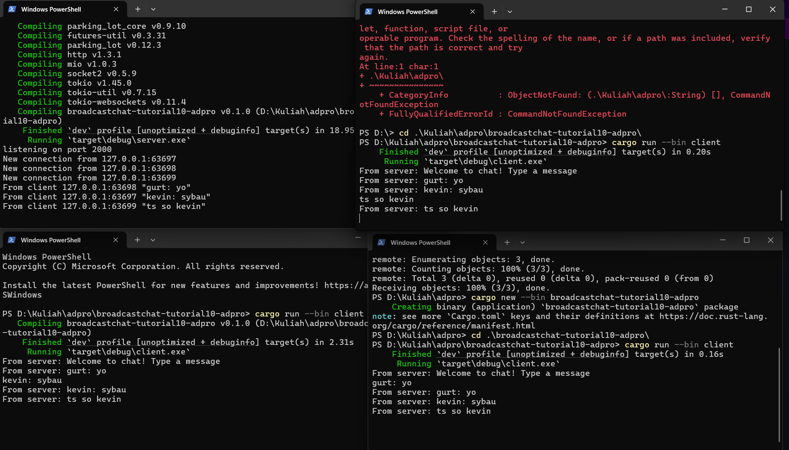

Pada eksperimen ini, saya menjalankan satu server dan tiga client untuk chat berbasis WebSocket. Server dijalankan di port 2000, dan masing-masing client berhasil terhubung dan mengirimkan pesan. Ketika satu client mengirim pesan, pesan tersebut berhasil dikirim ke seluruh client lainnya, menandakan bahwa broadcast berjalan dengan baik.