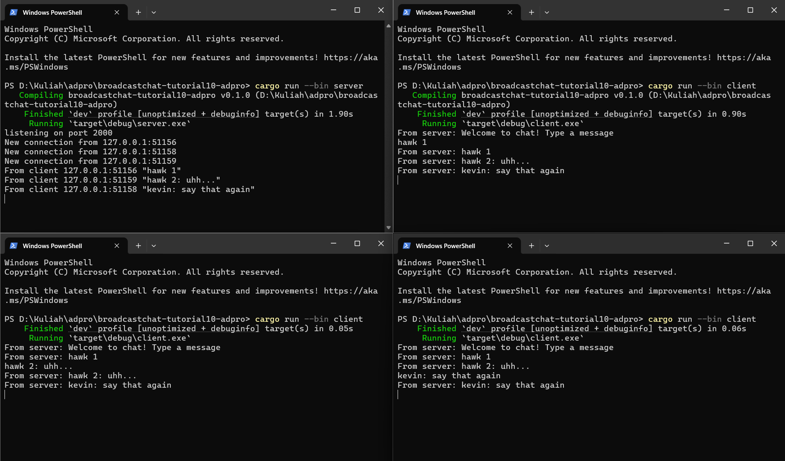
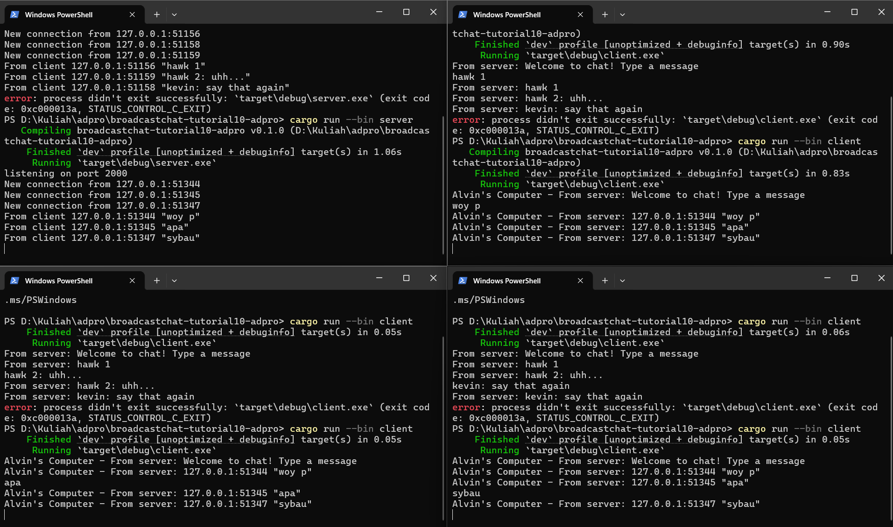

Pada eksperimen ini, saya menjalankan satu server dan tiga client untuk chat berbasis WebSocket. Server dijalankan di port 2000, dan masing-masing client berhasil terhubung dan mengirimkan pesan. Ketika satu client mengirim pesan, pesan tersebut berhasil dikirim ke seluruh client lainnya, menandakan bahwa broadcast berjalan dengan baik.



Pada eksperimen kali ini, kita menjalankan server pada port yang berbeda dari sebelumnya(```TcpListener::bind``` untuk server dan ```ClientBuilder::from_uri``` untuk client), setelah port diubah, program masih dapat berjalan lancar dan komunikasi antara client dan server masih tetap real-time. 



Pada eksperimen kali ini, saya menambahkan informasi alamat IP dan port pengirim pada setiap pesan yang diterima oleh client. Perubahan ini dilakukan di sisi server, yaitu dengan memodifikasi ```bcast_tx.send``` agar menyisipkan data ```addr```, yang merepresentasikan alamat dan port client pengirim pesan. Dengan begitu, setiap client yang menerima pesan dapat mengetahui asal pesan tersebut meskipun belum ada identitas atau username yang diimplementasikan.